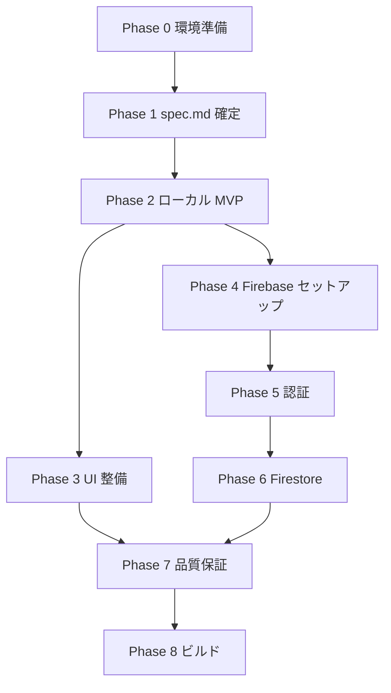

# 日記アプリ 開発タスクリスト / 実装計画

> **参照元**: [`spec.md`](../spec.md)  
> **最終更新**: 2026-06-11（D1–D3 確定）

このドキュメントは、ハンズオン全体の開発工程をフェーズ別に整理したタスクリスト兼実装計画です。  
各タスクは Cursor / OpenCode に渡せる粒度で書いています。完了したら `[x]` に変更してください。

---

## 1. プロジェクト概要

| 項目 | 内容 |
| --- | --- |
| アプリ名 | 日記アプリ (diary-app) |
| 目的 | React Native + Expo + Firebase を題材にした AI 駆動開発ハンズオン |
| 実行環境 | Expo Go（Expo SDK 54） |
| パッケージマネージャ | pnpm |
| 品質ゲート | `just check` / `just test` / `just doctor` |

### 1.1 前提となる技術選定（教員ノートより）

- Firebase は **Firebase JS SDK** (`firebase` パッケージ) を採用する  
  → `@react-native-firebase/*` は Expo Go 非対応のため使わない
- API Key 等の秘密情報はリポジトリにコミットしない  
  → Firebase の Web API Key は公開前提だが、`.env` 運用ルールは `spec.md` で確定する
- ビルド配布は EAS internal distribution（教員 1 名の Apple Developer で十分）

### 1.2 現状の実装スナップショット

| 領域 | 状態 | 該当ファイル |
| --- | --- | --- |
| 一覧画面 | ✅ 実装済 | `src/app/index.tsx` |
| 新規作成画面 | ✅ 実装済 | `src/app/new.tsx` |
| 状態管理（メモリ） | ✅ 実装済 | `src/store/entries.tsx` |
| シードデータ | ✅ 5 件ハードコード | `src/store/entries.tsx` |
| 詳細・編集・削除 | ❌ 未実装 | — |
| 永続化 | ❌ 未実装（再起動でユーザー追加分が消える） | — |
| Firebase | ❌ 未導入 | — |
| 認証 | ❌ 未実装 | — |
| 単体テスト | ✅ 基本 3 件 | `src/store/entries.test.tsx` |

---

## 2. 設計上の未決定事項（`spec.md` で確定が必要）

`spec.md` が空のため、以下は **推奨案つき** で暫定前提としています。  
`/grill-me` で意思決定した内容は `spec.md` に反映し、本タスクリストも更新してください。

| # | 論点 | 状態 | 影響するフェーズ |
| --- | --- | --- | --- |
| D1 | 認証方式 | ✅ **メール + パスワード** | Phase 5 |
| D2 | 1 日 1 件制限 | ✅ **なし**（複数エントリ可） | Phase 2 |
| D3 | データ保存先 | ✅ **`users/{uid}/entries/{entryId}`** | Phase 6 |
| D4 | オフライン対応 | 未確定（推奨: 初版はスコープ外） | Phase 6–7 |
| D5 | ローカル永続化 | 未確定（推奨: AsyncStorage は任意） | Phase 2 |
| D6 | 詳細画面の遷移 | 未確定（推奨: `/entry/[id]`） | Phase 2 |
| D7 | Firebase 設定の渡し方 | 未確定（推奨: `EXPO_PUBLIC_*`） | Phase 4 |
| D8 | シードデータ | 未確定（推奨: Firebase 接続後に削除） | Phase 6 |

---

## 3. フェーズ別タスクリスト

### Phase 0: 開発環境の準備

ハンズオン初日。テンプレート済みの項目は確認のみ。

- [ ] WSL2 Ubuntu でプロジェクトを `~/projects/2026-add-diary-app` に配置した
- [ ] `direnv allow` 済み、`just doctor` が通る
- [ ] Cursor を WSL モード（左下 `WSL: Ubuntu`）で開いている
- [ ] `just start` で Expo Go からアプリが起動する
- [ ] OpenCode に Anthropic API Key を登録した
- [ ] `just check` / `just test` がローカルで通ることを確認した

**完了条件**: スマホで一覧・新規作成・保存が動作し、ターミナルの品質コマンドが成功する。

---

### Phase 1: 仕様の確定（`spec.md`）

実装のブレを防ぐため、コードを書く前に仕様を固定する。

- [ ] `/grill-me` で D1–D8 の未決定事項をすべて決める
- [ ] `spec.md` に以下を記述する
  - [ ] アプリの目的・対象ユーザー
  - [ ] 画面一覧と画面遷移図
  - [ ] データモデル（`Entry` 型、Firestore コレクション構造）
  - [ ] 認証フロー（サインアップ / ログイン / ログアウト）
  - [ ] 非機能要件（Expo Go 対応、秘密情報の扱い）
  - [ ] スコープ外（やらないこと）
- [ ] `spec.md` の内容に合わせて本ファイル（`docs/tasks.md`）の未決定事項を更新する

**完了条件**: 画面追加・Firebase 導入の判断が `spec.md` だけで再現できる。

---

### Phase 2: ローカル MVP の完成

Firebase 導入前に、オンデバイスだけで完結する日記体験を揃える。  
既存 UI の延長線上で進める。

#### 2.1 データ層の拡張

- [ ] `Entry` 型に変更が必要なら `spec.md` に沿って更新する
- [ ] `useEntries` に以下を追加する
  - [ ] `getEntry(id: string): Entry | undefined`
  - [ ] `updateEntry(id: string, input: EntryInput): void`
  - [ ] `deleteEntry(id: string): void`
- [ ] 各メソッドの Jest テストを `src/store/entries.test.tsx` に追加する

#### 2.2 画面・ナビゲーション

- [ ] 一覧のエントリタップで詳細画面へ遷移する（`src/app/index.tsx`）
- [ ] 詳細画面 `src/app/entry/[id].tsx` を新規作成する
  - [ ] 日付・気分・タイトル・本文を表示する
  - [ ] 編集ボタン・削除ボタンを置く
- [ ] 編集画面 `src/app/entry/[id]/edit.tsx` を新規作成する（または詳細を編集モード兼用）
  - [ ] `new.tsx` と同様のフォーム UI を再利用する
  - [ ] 保存で `updateEntry` を呼ぶ
- [ ] 削除時に確認ダイアログ（`Alert.alert`）を出す
- [ ] `src/app/_layout.tsx` に新ルートを登録する

#### 2.3 UX の磨き込み（ローカル範囲）

- [ ] 今日のカード: 当日分のエントリが複数あっても**最新 1 件**をプレビュー表示する
- [ ] 空状態: エントリ 0 件時のメッセージを表示する
- [ ] 保存不可状態（タイトル・本文とも空）の挙動を `spec.md` と一致させる

#### 2.4 （任意）ローカル永続化

D5 で採用する場合のみ。

- [ ] `@react-native-async-storage/async-storage` を導入する（Expo SDK 54 互換バージョン）
- [ ] 起動時に AsyncStorage からエントリを復元する
- [ ] `addEntry` / `updateEntry` / `deleteEntry` 時に保存する
- [ ] 復元・保存のテストを追加する

**完了条件**: 再起動（永続化なしの場合はセッション内）で CRUD が一通り動き、`just test` が通る。

---

### Phase 3: UI / コンポーネント整備

重複を減らし、以降の Firebase 差し替えを楽にする。

- [ ] 共通カラートークンを `src/theme/colors.ts` 等に切り出す
- [ ] エントリカードを `src/components/EntryCard.tsx` に抽出する
- [ ] 気分チップ列を `src/components/MoodPicker.tsx` に抽出する
- [ ] 日付フォーマットを `src/lib/formatDate.ts` に集約する
- [ ] `just check` で型エラー・lint エラーがないことを確認する

**完了条件**: `index.tsx` / `new.tsx` / 詳細・編集画面が共通コンポーネントを使い、見た目が揃っている。

---

### Phase 4: Firebase プロジェクトセットアップ

#### 4.1 Firebase Console（手動作業）

- [ ] Firebase プロジェクトを作成する
- [ ] Authentication を有効化する（メール + パスワード）
- [ ] Cloud Firestore を有効化する（テストモード or セキュリティルール付き）
- [ ] Web アプリを登録し、設定オブジェクトを取得する

#### 4.2 アプリへの組み込み

- [ ] `firebase` パッケージをインストールする（Expo SDK 54 互換）
- [ ] `src/lib/firebase.ts` を作成し、Firebase App を初期化する
- [ ] 環境変数の読み込み方を決めて実装する（D7）
  - [ ] `.env.example` に必要な変数名を列挙する
  - [ ] `.gitignore` に `.env` / `.env.local` が含まれることを確認する
- [ ] `just doctor` / `just check` が通ることを確認する

**完了条件**: アプリ起動時に Firebase 初期化がエラーなく完了する（認証・Firestore 未使用でも可）。

---

### Phase 5: 認証

#### 5.1 認証状態管理

- [ ] `src/store/auth.tsx`（または同等）に Auth コンテキストを作成する
- [ ] `onAuthStateChanged` でログイン状態を購読する
- [ ] `signUp` / `signIn` / `signOut` 関数を公開する
- [ ] 認証関連のユニットテストを追加する（モックを使用）

#### 5.2 認証 UI

- [ ] ログイン画面 `src/app/login.tsx` を作成する
- [ ] サインアップ画面 `src/app/signup.tsx` を作成する（またはログインと統合）
- [ ] 未ログイン時は認証画面へリダイレクトする（`src/app/_layout.tsx`）
- [ ] ログアウト操作を設定画面またはヘッダーに追加する
- [ ] 認証エラーメッセージをユーザー向けに表示する

**完了条件**: サインアップ → ログイン → ログアウトが Expo Go 上で動作する。

---

### Phase 6: Firestore 連携（クラウド永続化）

#### 6.1 データ設計

- [ ] Firestore のコレクション構造を `spec.md` に記載した通りに実装する
- [ ] セキュリティルールを作成する（本人の `uid` 配下のみ読み書き可）
- [ ] `updatedAt` / `createdAt` フィールドの扱いを決める

#### 6.2 リポジトリ層

- [ ] `src/lib/entriesRepository.ts` を作成する
  - [ ] `listEntries(uid): Promise<Entry[]>`
  - [ ] `createEntry(uid, input): Promise<Entry>`
  - [ ] `updateEntry(uid, id, input): Promise<void>`
  - [ ] `deleteEntry(uid, id): Promise<void>`
- [ ] `src/store/entries.tsx` をリポジトリ経由に差し替える
- [ ] シードデータを廃止する（D8）

#### 6.3 リアルタイム同期（任意）

- [ ] `onSnapshot` で一覧をリアルタイム更新する
- [ ] 購読のクリーンアップ（`useEffect` の unsubscribe）を実装する

#### 6.4 UX

- [ ] 読み込み中インジケータを表示する
- [ ] 保存失敗時のエラー表示・リトライ導線を実装する
- [ ] オフライン時の挙動を `spec.md` のスコープに合わせる

**完了条件**: ユーザー A のデータがユーザー B から見えず、再ログイン後もエントリが復元される。

---

### Phase 7: 品質保証・仕上げ

- [ ] `just check` がクリーンに通る
- [ ] `just test` のカバレッジが主要フロー（CRUD・認証ガード）を押さえている
- [ ] Expo Go で実機確認する
  - [ ] 新規作成 → 一覧反映 → 詳細 → 編集 → 削除
  - [ ] ログアウト → 再ログイン
  - [ ] ネットワーク断時（スコープ内なら）
- [ ] アクセシビリティの最低限（タップ領域、コントラスト）を確認する
- [ ] 不要な `console.log`・デッドコードを除去する

**完了条件**: 教員・他の生徒が手順通りに再現できる品質。

---

### Phase 8: ビルド・配布（任意 / 上級）

Expo Go で足りる場合はスキップ可。

- [ ] `eas login` / `firebase login` を実行する
- [ ] EAS プロジェクトをリンクする
- [ ] `just build-android` または `just build-ios` でプレビュービルドを作成する
- [ ] 実機にインストールして動作確認する

**完了条件**: Expo Go 以外のバイナリでも主要機能が動作する。

---

## 4. 依存関係（実装順序）



**推奨実装順**: Phase 0 → 1 → 2 → 4 → 5 → 6 → 3 と 7 は並行可 → 8 は必要時のみ

> Phase 3（UI 整備）は Phase 2 の後でも Phase 6 の前でもよいが、  
> Firebase 差し替えの前にコンポーネント分割しておくと手戻りが少ない。

---

## 5. マイルストーン

| マイルストーン | 含むフェーズ | デモで見せるもの |
| --- | --- | --- |
| M0: 環境 Ready | Phase 0 | Expo Go でテンプレート起動 |
| M1: 仕様 Fixed | Phase 1 | `spec.md` レビュー完了 |
| M2: ローカル日記 | Phase 2–3 | CRUD が端末内で完結 |
| M3: クラウド日記 | Phase 4–6 | ログイン後にデータがクラウド同期 |
| M4: リリース Ready | Phase 7–8 | 品質ゲート通過・（任意）実機ビルド |

---

## 6. AI への依頼例（コピペ用）

各フェーズで Cursor / OpenCode に渡すプロンプト例。

```
# Phase 2 例
spec.md と docs/tasks.md の Phase 2 に従い、
日記エントリの詳細画面と編集・削除機能を実装してください。
既存の src/store/entries.tsx と Expo Router の構成を踏襲し、
just test が通るところまでお願いします。

# Phase 5 例
docs/tasks.md Phase 5 に従い、Firebase Authentication（メール/パスワード）の
ログイン・サインアップ画面と Auth コンテキストを実装してください。
未ログイン時は /login にリダイレクトしてください。

# Phase 6 例
docs/tasks.md Phase 6 に従い、Firestore に日記エントリを保存する
entriesRepository を作り、entries ストアを差し替えてください。
セキュリティルール案もコメントで示してください。
```

---

## 7. 進捗の見える化

| フェーズ | 状態 | メモ |
| --- | --- | --- |
| Phase 0 環境準備 | ⬜ 未着手 | |
| Phase 1 spec.md | 🟨 一部完了 | D1–D3 確定済。D4–D8 残 |
| Phase 2 ローカル MVP | 🟨 一部完了 | 一覧・新規のみ |
| Phase 3 UI 整備 | ⬜ 未着手 | |
| Phase 4 Firebase 設定 | ⬜ 未着手 | |
| Phase 5 認証 | ⬜ 未着手 | |
| Phase 6 Firestore | ⬜ 未着手 | |
| Phase 7 品質保証 | ⬜ 未着手 | |
| Phase 8 ビルド | ⬜ 未着手 | 任意 |

---

## 8. 次のアクション

1. **`/grill-me` を続行**し、セクション 2 の D1–D8 を決めて `spec.md` に書き込む  
2. **Phase 2** から実装を開始する（詳細・編集・削除）  
3. フェーズ完了ごとに本ファイルのチェックボックスとセクション 7 を更新する
